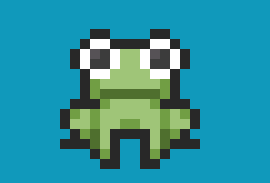

# PixiJS

## PixiJSとは

Pixijsとはブラウザ上で様々な2Dグラフィックス処理を実現するためのJavascriptライブラリ。GPUを使って3Dグラフィックを高速に描画するWebGL技術を応用して、2Dグラフィックス描画を高速に処理することができる。


### できること

- オブジェクトの描画
- オブジェクトのアニメーション（移動・回転・コマ送りアニメーション）
- フィルター処理
- オブジェクトとのインタラクション（クリックやドラッグなどのユーザー操作の検知）

などができるそうです。

### メリット

- 処理の記述がライブラリを使用しない場合に比べて簡単
- スマホでも動く
- 最適化されているため軽い

## 使い方

### PIXI.Application

Pixijsを使うには`PIXI.Application`インスタンスを起点にします。

```html
<body>
    <main id='app'>
        <!-- ここにPixiの描画領域(canvas)が入る -->
    </main>
</body>
```
```javascript
const app = new PIXI.Application({
    width: 800,
    height: 600,
    backgroundColor: 0x1099bb
})
```
コンストラクタの引数には各設定を記述したオブジェクトを渡しており、今回は幅、高さ、背景色を指定しています。

`PIXI.Applicaton`はいくつかの基本的な機能がひとまとめになった、Pixiを使った処理の土台となるもので、以下のようなプロパティを持っています。

|プロパティ|説明|
|---|---|
|`stage`|PixiJS の画像データオブジェクトを配置するコンテナ|
|`view`|描画するcanvas要素|
|`screen`|viewの大きさなどの情報を持ったRectangle|
|`loader`|ファイル読み込み管理|
|`renderer`|(WebGL)描画部分|
|`ticker`|描画のタイマー(フレーム)管理|

### view
```javascript
let el = document.getElementById('app')
el.appendChild(app.view)
```

`PIXI.Applicaton`インスタンス化した次は、そのプロパティである`view`（描画領域`<canvas>`要素）をHTMLの`id='app'`の要素に`appendChild()`しています。
`view`には`<canvas>`が入っているので、HTML側は空の状態でok

### screen
`screen`はPIXI.Rectangleオブジェクトであり、Rectangleという名前の通りｘ、ｙ、width、heightなどの四角形を形作る情報を持っています。
`app.screen`は`app.view`の大きさなどの情報を保持しており、今回の場合、コンストラクタの引数として渡した「width:400, height:300」の値はここに保持されています。

### stage (PIXI.Container)
```javascript
app.stage.addChild(animSprite);
```
`stage`は`PIXI.Container`クラスのインスタンスであり、名前の通り、PixiJSの描画物をまとめて詰め込む入れ物（コンテナ）です。

また、新しくコンテナ(`PIXI.Container`)を作って、そこにオブジェクトをまとめることができます。`app.stage`もコンテナの一つであり、複数のコンテナを入れ子のようにすることで、レイヤーのような使い方をすることができます。

```javascript
// コンテナを作成
let sampleContainer = new PIXI.Container();
// 座標を指定
sampleContainer.x = 300;
sampleContainer.y = 300;
// 親コンテナ(app.stage)に追加
app.stage.addChild(sampleContainer);

// 円を作成
let circle = new PIXI.Graphics() 
.beginFill(0xff0000)              
.drawEllipse(0,0,30,30)           
.endFill();     

// コンテナにいれる
sampleContainer.addChild(circle);
```

コンテナを移動させたり回転させると中に入れたオブジェクトも一緒に動くようになります。
コンテナにオブジェクトを入れるには`addChild()`を使います。
また、コンテナの大きさは中に入れるオブジェクトの大きさや位置によって変化し、事前に大きさを指定することはできないようです。

### Pixi.Applicationの構造

Pixi.Applicationの構造を図にするとこんな感じになります。


### 画像を読み込んで表示させたい

```javascript
// 画像を読み込んでテクスチャにする
let sampleTexture = new PIXI.Texture.from('./img/sample.png');
// 読み込んだテクスチャから、スプライトを生成する
let sampleSprite = new PIXI.Sprite(sampleTexture);
//表示領域に追加する
app.stege.addChild(sampleSprite);
```
スプライトの生成は、テクスチャの生成を省略して
```javascript
let sampleSprite = new PIXI.Sprite.from('./img/sample.png');
```
とすることもできます。読み込んだ画像を一度しか使用しない場合は、`new PIXI.Sprite.from()`のほうが簡潔な書き方になります。

※スプライトとは？
複数の画像や図形を合成して表示する技術のこと。今回の場合は、単なる画像のこと。

### PIXI.Graphics
図形などを描画するには`PIXI.Graphics`を扱います。

```javascript
// 楕円を作成
let ellipse = new PIXI.Graphics() // PIXI.Graphicsのインスタンスを生成
.beginFill(0xff0000)              // endFill()までの描画に対する塗りつぶし色指定
.drawEllipse(0,0,30,20)           // (中心のx座標, 中心のy座標, 幅, 高さ)
.endFill();                       // ここまでに描いた図形を塗りつぶす

app.stage.addChild(ellipse);
```
### テキスト表示
Pixiではテキストオブジェクトを生成してスプライトや図形と同様に扱うことができます。
```javascript
let text = new PIXI.Text(
  'ゲロゲーロ',
  {
    fontSize: 50,
    fill: 0xffffff,
  });

text.x = 10;
text.y = 10;

app.stage.addChild(text);
```

### PIXI.AnimatedSprite
`PIXI.AnimatedSprite()`で、スプライトシートまたは複数の画像を使用することで、連続する2D表現を実現することができます。
```javascript
// カエルのアニメーション

const spriteWidth = 180;
const spriteHeight = 180;

// テクスチャの配列を用意する
const frames = [
    PIXI.Texture.from('../img/frog_1.png'),
    PIXI.Texture.from('../img/frog_2.png'),
    PIXI.Texture.from('../img/frog_3.png'),
];

// テクスチャの配列からAnimatedSpriteを作成する
const animSprite = new PIXI.AnimatedSprite(frames);
animSprite.x = spriteWidth / 2
animSprite.y = spriteWidth / 2
animSprite.pivot.set(spriteWidth / 2, spriteHeight / 2);
animSprite.animationSpeed = 0.08;
// アニメーション再生開始
animSprite.play();
app.stage.addChild(animSprite);
```


### PIXI.Ticker
`app.ticker`はフレーム更新時の処理を管理します。
```javascript
// アニメーション処理
app.ticker.add(animate);
let amountTime = 0;

function animate(delta) {
  animSprite.rotation += 0.02

  amountTime += delta

  animSprite.x = Math.sin(amountTime * 0.01) * app.renderer.width / 4 + app.renderer.width / 2;
  animSprite.y = Math.sin(amountTime * 0.005) * app.renderer.height / 4 + app.renderer.height / 2;
}
```
上記で使われている`delta`はPIXI.Tickerがコールバック関数を呼び出す際に渡してくる値であり、その意味は
> 「前フレームから今フレームまでの経過時間。
ただし単位は１フレームの通常の処理時間、つまり1/60秒（16.6666666…ミリ秒）を基準とした比率」

というもので、値としては大体1ぐらいになります。


### インタラクション

`interactive`プロパティで表示オブジェクトにインタラクティブ性を持たせることも可能です。
```javascript
// インタラクション(イベント)を有効化
animSprite.interactive = true;
// オブジェクトにマウスが重なった時、表示をポインターにする
animSprite.buttonMode = true;

// オブジェクトにイベントリスナーを設定する
animSprite.on('pointerdown', onFrogPointerDown) 
          .on('pointerup', onFrogPointerUp); // メソッドチェーン

// オブジェクトの上でマウスがクリックされたときの処理定義
function onFrogPointerDown() {
    animSprite.on('pointermove', moveFrog);
}

// オブジェクトをドラッグ中の処理定義
function moveFrog(e) {
    let position = e.data.getLocalPosition(app.stage);

    animSprite.x = position.x;
    animSprite.y = position.y;
}

function onFrogPointerUp() {
    animSprite.off('pointermove', moveFrog);    // ドラッグイベントリスナーを解除
}
```
オブジェクトの`on()`メソッドを使ってイベントリスナーを設定します。解除する場合は`off()`メソッドを使用します。

Pixijsにはドラッグを検知するイベントがないので、上記のような記述になっています。


